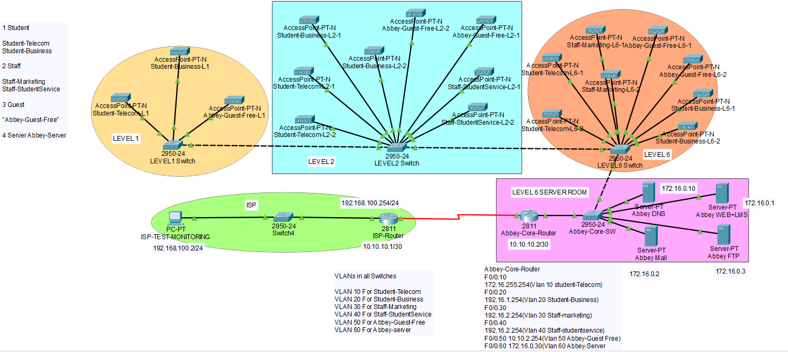

# Enterprise Network Lab – Cisco Packet Tracer

## Project Scope

This lab simulates a multi-level enterprise network including:

- ISP connectivity simulation
- Core router with subinterfaces (Router-on-a-Stick)
- VLAN segmentation across multiple switches
- Dedicated server VLAN
- Inter-VLAN routing
- WAN link simulation (10.10.10.0/30)

## Network Topology

---

## Objectives

- Design a segmented enterprise network
- Implement VLANs for departmental separation
- Configure inter-VLAN routing
- Deploy DHCP services
- Apply ACLs for traffic control
- Perform end-to-end connectivity testing

---

## Technologies Used

- Cisco Packet Tracer  
- VLAN configuration  
- Router configuration  
- DHCP services  
- Access Control Lists (ACLs)  
- IP addressing & subnetting  

---

## Skills Demonstrated

- Network segmentation
- Layer 2 and Layer 3 configuration
- Infrastructure troubleshooting
- Security best practices
- Structured documentation

---

Author: Monica Leiva  
Aspiring IT Support / Network Support Professional
